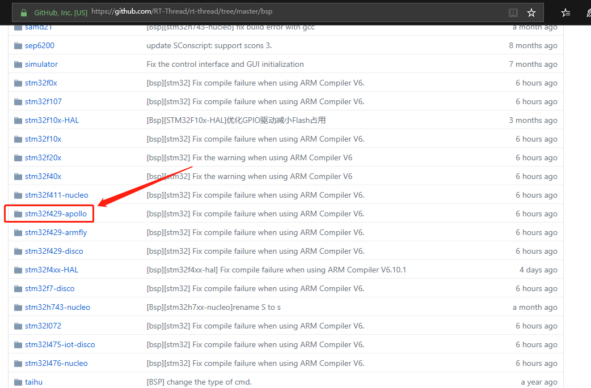
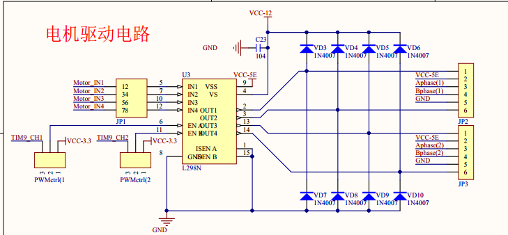
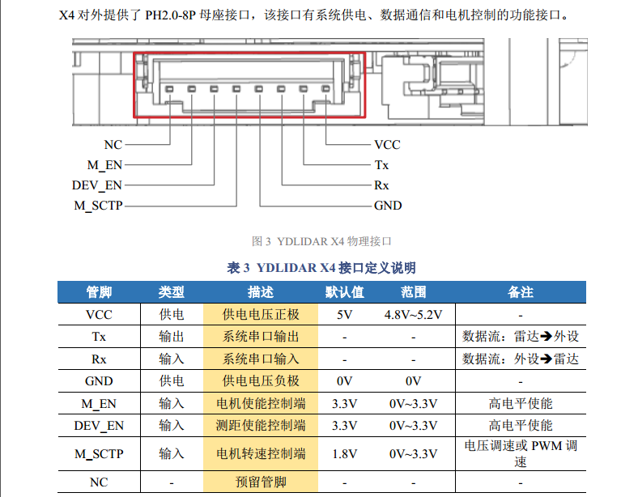
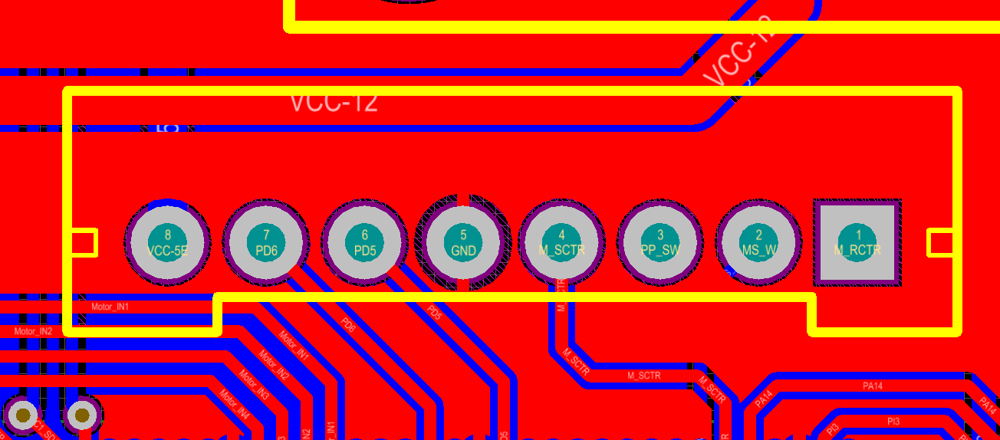
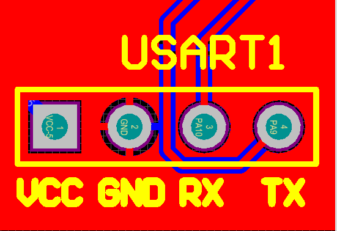
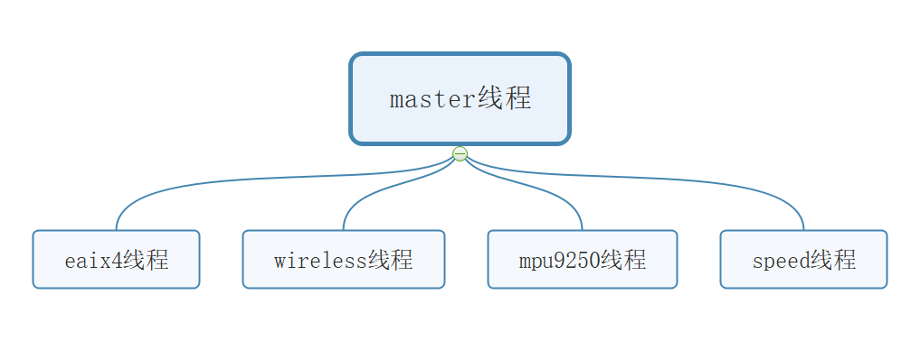

# 激光雷达避障小车 #

## 背景 ##

在做这辆小车之前，正值我大学学习生涯的迷茫期。有关嵌入式的学习，我基本是自学的。自学最大的坏处就是，没有一个系统的学习提纲，你无法充分了解你学习的进度、水平以及未来的方向。你可能会因为一个小成果而觉得自己可以了，也可能会突然有一天遇到一个专业知识更强的同龄人，而自我否定。为了能够接触到新知识，巩固以前所学，我决定做这样一辆小车。
## 选择操作系统 ##

在这之前我只学过 UCOS，但是 ucos 商用并不免费，一直耿耿于怀。所以趁着这次机会本着学习的目的我选择了 RT-Thread。期间也有考虑过 freertos 等其他实时操作系统但最终还是选择了 RT-Thrad 。原因如下：
 1. 代码开源，在 GitHub 可以下载到最新的源码。[GitHub地址](https://github.com/RT-Thread/rt-thread.git)
 2. 免费。（商用也免费，遵循 Apache License 2.0 协议）
 3. 组件丰富。[RT-Thread 软件包介绍](https://www.rt-thread.org/document/site/submodules/README/)
 4. 国产，社区这方面的问答支援比较好。[官方社区链接](https://www.rt-thread.org/qa/forum.php)

## 准备阶段 ##

 1. 从 GitHub 下载 RT-Thread 源码。
 2. 激光雷达，作为学生党买淘宝上最便宜。（当初买的时候最便宜的一款也要 499 QAQ，现在好像便宜点了）
 3. PCB的绘制，或者使用最小系统板外加模块。

 ## 使用现成的 bsp 工程 ##

 

 我选择的是 stm32f429-apollo 因为手头正好有正点原子 F429 的开发板，有好多驱动稍加修改甚至不修改直接就可以用了。

## 硬件部分 ##

### 1.主控芯片 ###

 stm32f429igt6

因为基础工程是根据 bsp stm32f429-apollo 改的，所以电路原理图上一些引脚的分配我也尽量按照 apollo 开发板的方案设计。

### 2.电机驱动部分 ###

电机驱动芯片使用 L298N 。控制小车的速度与方向。

电路原理图如下：

 

 电机自带AB相编码器，用于测速（pi闭环控制）。

### 3.激光雷达 ###

 查激光雷达数据手册

 

 激光雷达需要 5v 供电，串口通信，一个 M_SCTP PWM输入口控制转速（M_SCTP可默认拉高省出pwm口）。

 
### 4.蓝牙串口 ###

  因为使用了 RT-Thread 的组件 FinSH，（ FinSH 组件是 RT-Thread 的一大亮点。）为了方便无线调试，我使用两个配对好的蓝牙串口来通信，即插即用。

  

### 5.其他 ###

另外我还外加了 mpu9250模块，SDRAM、W25Q128、蜂鸣器、oled屏...等 用于以后的扩展。

## 程序部分 ##

整体的思路如下：

 

 1. eaix4线程： 用于对激光雷达数据的处理。
 2. wireless线程： 用于无线传输。
 3. mpu9250线程： 用于9轴姿态传感器数据的处理。
 4. speed线程： 用于速度的闭环控制。
