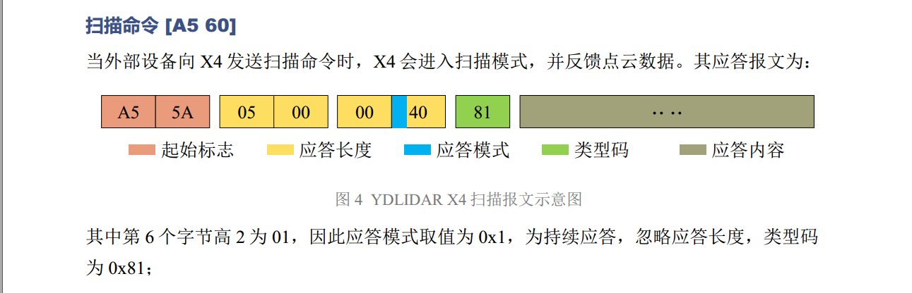
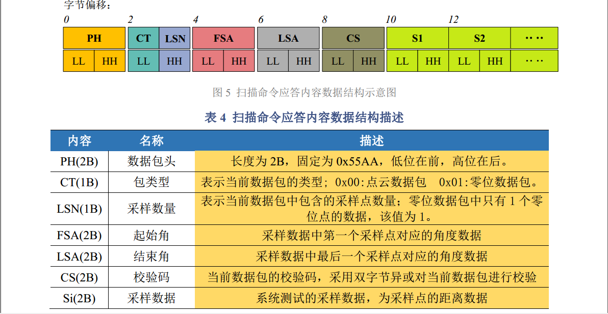
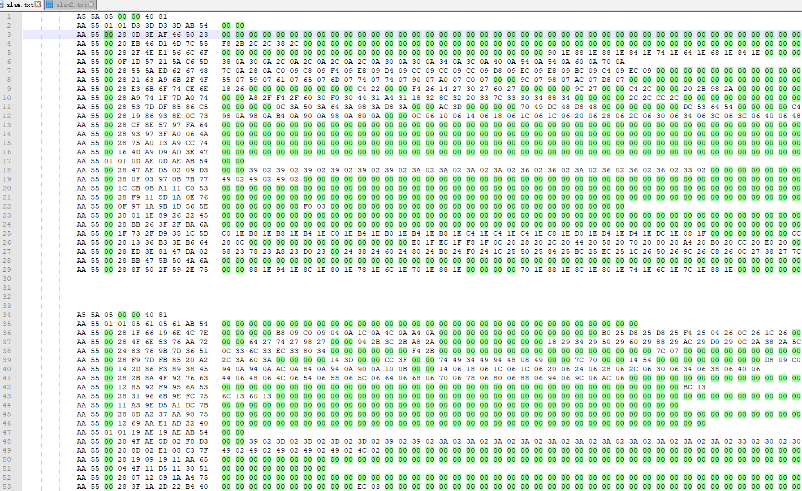
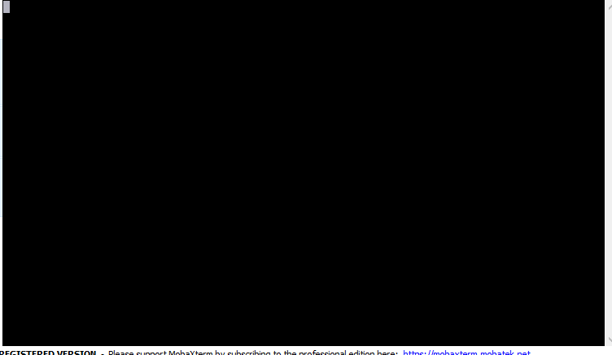

# 激光雷达避障小车 #

## 背景 ##

在做这辆小车之前，正值我大学学习生涯的迷茫期。有关嵌入式的学习，我基本是自学的。自学最大的坏处就是，没有一个系统的学习提纲，你无法充分了解你学习的进度、水平以及未来的方向。你可能会因为一个小成果而觉得自己可以了，也可能会突然有一天遇到一个专业知识更强的同龄人，而自我否定。为了能够接触到新知识，巩固以前所学，我决定做这样一辆小车。
## 选择操作系统 ##

在这之前我只学过 UCOS，但是 ucos 商用并不免费，一直耿耿于怀。所以趁着这次机会本着学习的目的我选择了 RT-Thread。期间也有考虑过 freertos 等其他实时操作系统但最终还是选择了 RT-Thrad 。原因如下：
 1. 代码开源，在 GitHub 可以下载到最新的源码。[GitHub地址](https://github.com/RT-Thread/rt-thread.git)
 2. 免费。（商用也免费，遵循 Apache License 2.0 协议）
 3. 组件丰富。[RT-Thread 软件包介绍](https://www.rt-thread.org/document/site/submodules/README/)
 4. 国产，社区这方面的问答支援比较好。[官方社区链接](https://www.rt-thread.org/qa/forum.php)

## 准备阶段 ##

 1. 从 GitHub 下载 RT-Thread 源码。
 2. 激光雷达，作为学生党买淘宝上最便宜。（当初买的时候最便宜的一款也要 499 QAQ，现在好像便宜点了）
 3. PCB的绘制，或者使用最小系统板外加模块。

 ## 使用现成的 bsp 工程 ##

 

 我选择的是 stm32f429-apollo 因为手头正好有正点原子 F429 的开发板，有好多驱动稍加修改甚至不修改直接就可以用了。

## 硬件部分 ##

### 1.主控芯片 ###

 stm32f429igt6

因为基础工程是根据 bsp stm32f429-apollo 改的，所以电路原理图上一些引脚的分配我也尽量按照 apollo 开发板的方案设计。

### 2.电机驱动部分 ###

电机驱动芯片使用 L298N 。控制小车的速度与方向。

电路原理图如下：

 

 电机自带AB相编码器，用于测速（pi闭环控制）。

### 3.激光雷达 ###

 查激光雷达数据手册

 

 激光雷达需要 5v 供电，串口通信，一个 M_SCTP PWM输入口控制转速（M_SCTP可默认拉高省出pwm口）。


 
### 4.蓝牙串口 ###

  因为使用了 RT-Thread 的组件 FinSH，（ FinSH 组件是 RT-Thread 的一大亮点。）为了方便无线调试，我使用两个配对好的蓝牙串口来通信，即插即用。

  

### 5.其他 ###

另外我还外加了 mpu9250模块，SDRAM、W25Q128、蜂鸣器、oled屏...等 用于以后的扩展。

## 程序部分 ##

整体的思路如下：

 

 1. eaix4线程： 用于对激光雷达数据的处理。
 2. wireless线程： 用于无线传输。
 3. mpu9250线程： 用于9轴姿态传感器数据的处理。
 4. speed线程： 用于速度的闭环控制。
 5. master线程： 作为主线程负责创建其他子线程，以及处理其他子线程发送的传感器信息。

### 1.激光雷达 ###

查看雷达开发手册

图一：
 

图二：
 

 当向激光雷达设备发送 [A5 60] 的时候，激光雷达会连续不断的返回扫描到的数据，直到你发送停止扫描命令为止，基于这种特性选择使用 RT-Thread 的消息队列机制。
 
 

```c
rt_err_t eaix4_open(const char *name)
{
    rt_err_t res;
    /* 查找系统中的串口设备 */
    eaix4_device = rt_device_find(name);
    /* 查找到设备后将其打开 */
    if (eaix4_device != RT_NULL)
    {
        /* 注册回调函数 eaix4_intput */
        res = rt_device_set_rx_indicate(eaix4_device, eaix4_intput);
        /* 检查返回值 */
        if (res != RT_EOK)
        {
            rt_kprintf("set %s rx indicate error.%d\n", name, res);
            return -RT_ERROR;
        }
        /* 打开设备，以可读写、中断方式 */
        res = rt_device_open(eaix4_device, RT_DEVICE_OFLAG_RDWR | RT_DEVICE_FLAG_INT_RX);
        /* 检查返回值 */
        if (res != RT_EOK)
        {
            rt_kprintf("open %s device error.%d\n", name, res);
            return -RT_ERROR;
        }
    }
    else
    {
        rt_kprintf("can't find %s device.\n", name);
        return -RT_ERROR;
    }
    /* 初始化消息队列对象 */
    rt_mq_init(&Eaix4Mq, "EAIX4", Eaix4Buff, 1, sizeof(Eaix4Buff), RT_IPC_FLAG_FIFO);
    return RT_EOK;
}
```

```c
/* 串口接收数据回调函数 */
static rt_err_t eaix4_intput(rt_device_t dev, rt_size_t size)
{
    rt_uint8_t ch;
    /* 读取1字节数据 */
    if (rt_device_read(eaix4_device, 0, &ch, 1) == 1)
    {
        /* 将数据发送到消息队列中 */
        rt_mq_send(&Eaix4Mq, &ch, 1);
    }
    return RT_EOK;
}
/* 读取消息队列中的数据 */
rt_uint8_t  eaix4_getchar(void)
{
    rt_uint8_t ch;
    /* 读取消息队列中的数据 */
    rt_mq_recv(&Eaix4Mq, &ch, 1, RT_WAITING_FOREVER);
    return ch;
}
/* 向激光雷达发送数据 */
void eaix4_putchar(const rt_uint8_t c)
{
    rt_size_t len = 0;
    rt_uint32_t timeout = 0;
    do
    {
        len = rt_device_write(eaix4_device, 0, &c, 1);
        timeout++;
    }
    while (len != 1 && timeout < 500);
}
```

### 2.添加激光雷达控制命令 ###

```c
#include <finsh.h>
#define stop                    "-s"
#define force_stoppage          "-fs"
#define start_scanning          "-sc"
#define force_start_scanning    "-fsc"
#define get_version_information "-gvf"
#define get_health_status       "-ghs"
void Eaix4Scaning()
{
    eaix4_putchar(0xA5);
    eaix4_putchar(0x60);
}
void Eaix4stop()
{
    eaix4_putchar(0xA5);
    eaix4_putchar(0x65);
}
void Eaix4Version()
{
    eaix4_putchar(0xA5);
    eaix4_putchar(0x90);
}
void Eaix4Health()
{
    eaix4_putchar(0xA5);
    eaix4_putchar(0x91);
}
void eaix4cmd(int argc, char **argv)
{
    if (argc > 1)
    {
        if (!rt_strcmp(argv[1], stop))
        {
            Eaix4stop();
        }
        else if (!rt_strcmp(argv[1], force_stoppage))
        {
            eaix4_putchar(0xA5);
            eaix4_putchar(0x00);
        }
        else if (!rt_strcmp(argv[1], start_scanning))
        {
            Eaix4Scaning();
        }
        else if (!rt_strcmp(argv[1], force_start_scanning))
        {
            eaix4_putchar(0xA5);
            eaix4_putchar(0x61);
        }
        else if (!rt_strcmp(argv[1], get_version_information))
        {
            Eaix4Version();
        }
        else if (!rt_strcmp(argv[1], get_health_status))
        {
            Eaix4Health();
        }
        else
        {
            rt_kprintf("ERROR command !\n");
        }
    }
}
MSH_CMD_EXPORT(eaix4cmd, -s - fs - sc - fsc - gvf - ghs);
```

MSH_CMD_EXPORT 的作用就是向 msh 中增加命令。

## 几个主要的命令 ##

| 命令| 功能                   |
| ---------- | ---------------------------- |
|eaix4cmd -gvf   | 输出激光雷达版本信息.|
|eaix4cmd -sc    | 小车开始扫描,启动避障功能.|
|eaix4cmd -s     | 激光雷达停止扫描,但是不会停车.|
|carMove  -f     | 小车向前.|
|carMove  -b     | 小车后退.|
|carMove  -l     | 小车左转.|
|carMove  -r    |  小车右转.|

## 命令行演示 ##

 
 
## 最终实物效果 ##

 